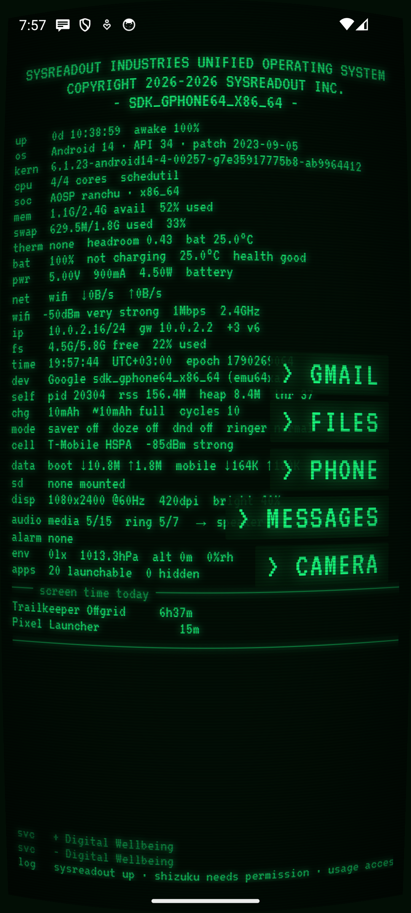
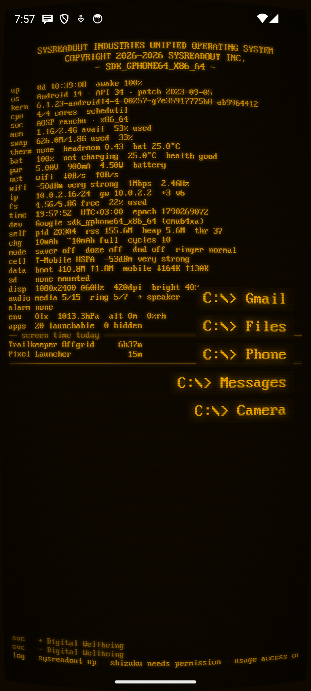
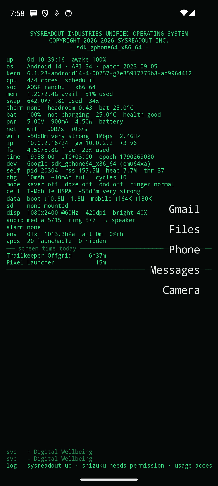
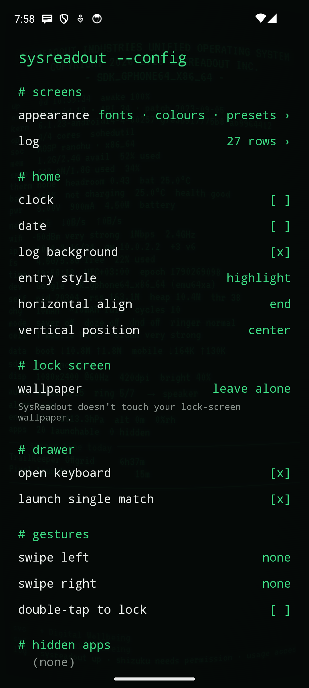

# SysReadout Launcher

**A minimal Android launcher that turns your home screen into a live system monitor.**

A short list of your apps sits in front of a terminal-style readout of the phone:
pinned status rows, monitor tables and a scrolling event log, optionally dressed as
an old CRT terminal. Built for people who like to know what their phone is doing.
SRL for short.

<p>




</p>

## Features

**Launcher**
- Pinned apps as text entries, as many as fit the screen; a searchable drawer (prefix, initials, substring; opens a single match by itself).
- Gestures: up for apps, down for notifications, left/right for an app you choose, double-tap to lock, long-press for settings.
- Hidden apps, renaming, work profiles.

**Readout**
- 52 optional status rows: CPU, memory, swap, thermal headroom, battery current and watts, network speed, Wi-Fi and mobile signal (spelled out, never drawn as bars), IP, storage, build properties, GPU, sensors, sunrise, moon phase and more. Choose and order them yourself.
- An editable banner header with live placeholders (`{year}`, `{device}`, `{android}`…).
- An event stream: network and power changes, installs, app switches, background services.

**System monitor** (each part optional)
- **[Shizuku](https://shizuku.rikka.app/):** processes by CPU or memory, every connection per app with the server's name, wakelocks, per-app battery drain, temperatures, per-core load, system errors from logcat.
- **Usage access:** screen time, unlocks, traffic per app, data used this month.
- **DNS monitor:** a local VPN that carries only DNS, showing which app looks up which server.
- **Location / phone / Bluetooth / activity:** GPS fix and satellites per constellation, serving cell and 5G/LTE-CA details, connected Bluetooth devices with battery, steps.

**Look**
- 7 presets (including green-phosphor and amber DOS terminals) plus your own.
- 11 bundled fonts and your own .ttf/.otf, with size, weight, spacing, case and colour per element.
- CRT effects: glow, scanlines, curvature, vignette, colour fringe, flicker, grain.
- Lock screen: your own image, or a snapshot of the log redrawn whenever the screen turns off.

Everything is explained in the **[user manual](docs/MANUAL.md)**.

## Install

- **F-Droid:** submission in preparation.
- **GitHub:** download the APK from the [latest release](https://github.com/AndSni/SysReadout-Launcher/releases/latest) and open it (allow "install unknown apps").

Then make it your home screen: **Settings › Apps › Default apps › Home app › SysReadout**.

Requires Android 8.0 (API 26) or newer; curvature and colour fringe need Android 13.

## Permissions

Nothing beyond the basics is used until you switch on the feature that needs it, and runtime permissions are requested at that moment.

| Permission | Used for | When |
|---|---|---|
| Network state, Wi-Fi state | connection type, IP, Wi-Fi signal rows | install-time, no prompt |
| Expand status bar | swipe down for notifications | install-time |
| Request delete packages | *uninstall* in the drawer's long-press menu (Android still asks you to confirm) | install-time |
| Set alarm | tapping the clock opens your alarms | install-time |
| Query all packages | real app names for system processes, connections and traffic | install-time |
| Set wallpaper | lock-screen image or log snapshot | only if you choose it |
| Internet | **only** the optional DNS monitor, which relays your apps' own lookups to your DNS server | only if you switch it on |
| Usage access | screen time, traffic, app switches | you grant it in Android settings |
| Notification access | notification row, stream and table | you grant it in Android settings |
| Accessibility (lock service) | double-tap to lock; reads no screen content | you enable it in Android settings |
| Location | GPS, satellites, Wi-Fi name, nearby networks, cell tower, sunrise rows | asked when you switch one on |
| Phone | 5G/LTE link details | asked when you switch it on |
| Bluetooth connect | connected devices and their battery | asked when you switch it on |
| Physical activity | step count | asked when you switch it on |
| Bluetooth (Android ≤ 11) | reading whether Bluetooth is on | install-time on old Android |

## Privacy

No ads, no analytics, no tracking, no accounts. Everything is read on the phone and kept in memory while the home screen is visible; nothing is written anywhere except your settings. The log stops when the home screen isn't visible.

## Build

Requirements: JDK 17 or 21, Android SDK (compileSdk 36).

```sh
./gradlew :app:assembleDebug :app:lintDebug :app:testDebugUnitTest
```

The Gradle root is the repository root; the app module is `app/`.

### Release signing

Release builds are signed from a `keystore.properties` file at the repository root, which is **not** in git:

```properties
storeFile=/absolute/path/to/sysreadout-release.jks
storePassword=…
keyAlias=sysreadout
keyPassword=…   # PKCS12 keystores: same as storePassword
```

Without it, `assembleRelease` falls back to the debug key. CI gets the same values from repository secrets (`RELEASE_KEYSTORE_B64`, `RELEASE_KEYSTORE_PASSWORD`, `RELEASE_KEY_ALIAS`, `RELEASE_KEY_PASSWORD`).

### Releasing a version

1. Bump `versionCode` (+1) and `versionName` in `app/build.gradle.kts`.
2. Add `metadata/en-US/changelogs/<versionCode>.txt`.
3. Commit and push to `main`; CI publishes a rolling [`latest`](https://github.com/AndSni/SysReadout-Launcher/releases/tag/latest) release.
4. Put the full hash of that commit into `.fdroid.yml` (`commit:`), update `versionName`, `versionCode`, `CurrentVersion`, `CurrentVersionCode`, commit and push.
5. Tag the release commit `vX.Y.Z` and push the tag. `release-tag.yml` publishes a permanent release whose `SysReadout-Launcher.apk` is what F-Droid compares its own build against (`Binaries`, `AllowedAPKSigningKeys` in `.fdroid.yml`).

Signing certificate SHA-256: `03873cc1869db581465c718d15b58d7f80999dec058ff21617b58267760a91bb`

## Credits

- Fonts (licences in [`app/src/main/assets/licenses`](app/src/main/assets/licenses), also viewable in the app under settings › about):
  JetBrains Mono, IBM Plex Mono, Space Mono, Share Tech Mono, VT323, Major Mono Display, Press Start 2P and Silkscreen under the SIL Open Font License 1.1;
  Px437 IBM VGA 8x16 by VileR ([int10h.org](https://int10h.org/oldschool-pc-fonts/)) under CC BY-SA 4.0.
- [Shizuku](https://github.com/RikkaApps/Shizuku) API (Apache-2.0), [Haze](https://github.com/chrisbanes/haze) (Apache-2.0), AndroidX and Jetpack Compose (Apache-2.0).
- Inspired by [Olauncher](https://github.com/tanujnotes/Olauncher) and [mLauncher](https://github.com/CodeWorksCreativeHub/mLauncher).

## License

GPL-3.0 — see [`LICENSE`](LICENSE).
